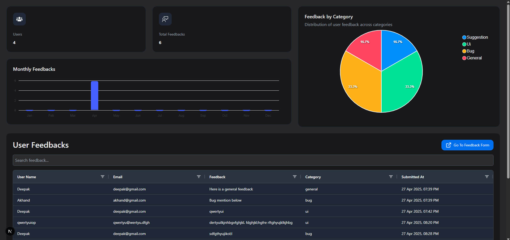
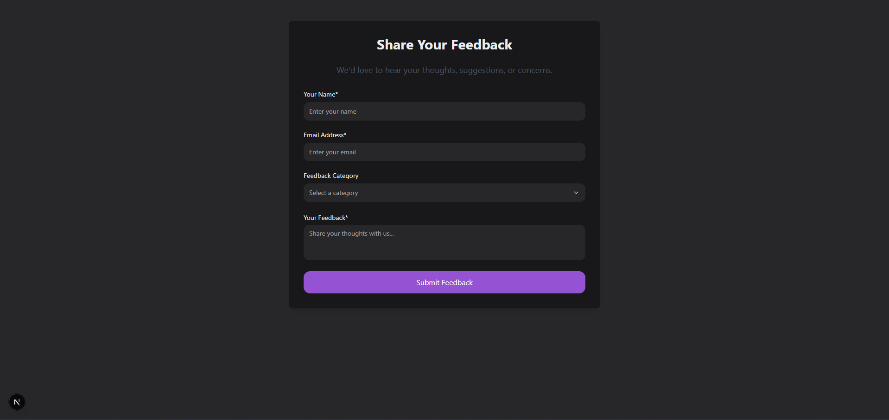

# User Feedback System

This project is a full-stack user feedback system. It allows users to submit feedback through a web interface, stores the feedback in a database, and displays it on a dashboard.

## Project Structure

```
user-feedback-system/
├── backend/         # Node.js, Express, MongoDB
└── frontend/        # Next.js 15
```

## Technologies Used

* **Backend**: Node.js, Express.js
* **Frontend**: Next.js 15 (React framework)
* **Database**: MongoDB

## Prerequisites

* Node.js and npm installed
* MongoDB installed and running

## Setup and Installation

1.  **Clone the repository:**
    ```bash
    git clone <https://github.com/deepakmod/user-feedback-system.git>
    cd user-feedback-system
    ```

2.  **Backend Setup:**
    * Navigate to the backend directory:
        ```bash
        cd backend
        ```
    * Install dependencies:
        ```bash
        npm install
        ```
    * Create a `.env` file in the `backend` directory.
    * Add your MongoDB connection string to the `.env` file:
        ```env
        MONGO_URI=your_mongodb_connection_string_here
        ```
        *(Replace `your_mongodb_connection_string_here` with your actual MongoDB URI, e.g., `mongodb://localhost:27017/feedbackdb`)*

3.  **Frontend Setup:**
    * Navigate to the frontend directory:
        ```bash
        cd ../frontend
        ```
    * Install dependencies:
        ```bash
        npm install
        ```
    * Create a `.env.local` file in the `frontend` directory (Next.js uses `.env.local` for local environment variables).
    * Add the backend API URL to the `.env.local` file:
        ```env
        NEXT_PUBLIC_BACKEND_API_URL=http://localhost:5000
        ```
        *(Adjust the port `5000` if your backend runs on a different port).*

## Running the Application

1.  **Start the Backend Server:**
    * Navigate to the `backend` directory:
        ```bash
        cd ../backend
        ```
    * Start the server (replace with your actual start script command if different, e.g., `npm start`, `yarn start`, `node server.js`):
        ```bash
        npm start
        ```

2.  **Start the Frontend Development Server:**
    * Navigate to the `frontend` directory:
        ```bash
        cd ../frontend
        ```
    * Start the development server:
        ```bash
        npm run dev
        ```

3.  **Access the Application:**
    * Open your web browser and go to `http://localhost:3000` (or the port specified by Next.js when it starts).

## Frontend Page Routes

The frontend application uses the following routes:

* `/`: Feedback Dashboard - Displays collected feedback.
* `/feedback`: Feedback Submission Form - Allows users to submit new feedbak.


## API Endpoints (Backend)

* `GET /health`: To Check DB connection.
* `POST /feedback`: Submit new user feedback.
* `GET /feedback`: Retrieve feedback data for the dashboard.
* `GET /feedback/stats`: Retrieve feedback stats data for the dashboard.

## Features

* Feedback submission form.
* Dashboard to display collected feedback.
* (Optional) Filtering and sorting options on the dashboard.
* (Optional) Feedback categorization.

## Screenshots
**Feedback Dashboard (`/`):**


**Feedback Form (`/feedback`):**


## Contributing

Pull requests are welcome. For major changes, please open an issue first to discuss what you would like to change.
